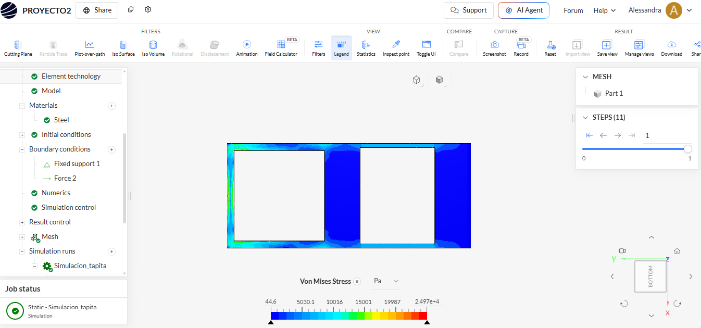

# Análisis de Simulación Estructural - Tapita de Caja Eléctrica

## Descripción del modelo

Se realizó el diseño de una **tapita para una caja eléctrica**, como parte del proyecto integrador. La pieza fue modelada mediante diseño CAD y posteriormente utilizada para realizar un análisis estructural en SimScale.

* **Pieza:** Tapita de caja eléctrica.
* **Dimensiones principales:** **350 mm × 150 mm**.
* **Material:** **PLA**.
* **Función:** Cubrir y proteger los componentes internos de la caja eléctrica.
* **Diseño:** La tapita presenta una geometría rectangular y pequeños orificios destinados a la fijación de la pieza a la estructura.
* **Análisis:** Simulación estructural mediante el método de elementos finitos.

## Condiciones de frontera

Para la simulación se consideraron condiciones de soporte en las zonas de fijación de la tapita y una carga aplicada sobre la pieza.

* **Soporte:** Fixed support.
* **Sistema de coordenadas:** Global.
* **Carga:** Force.
* **Mallado:** Standard.
* **Sizing:** Automatic.

## Captura del diseño

## Conclusión

La tapita diseñada, con dimensiones principales de **350 mm × 150 mm**, forma parte de la estructura de la caja eléctrica y permite proteger los componentes internos. El análisis estructural permite evaluar el comportamiento de la pieza ante las condiciones de carga establecidas.
