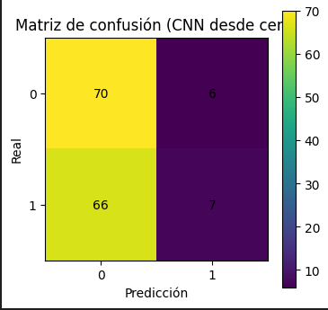
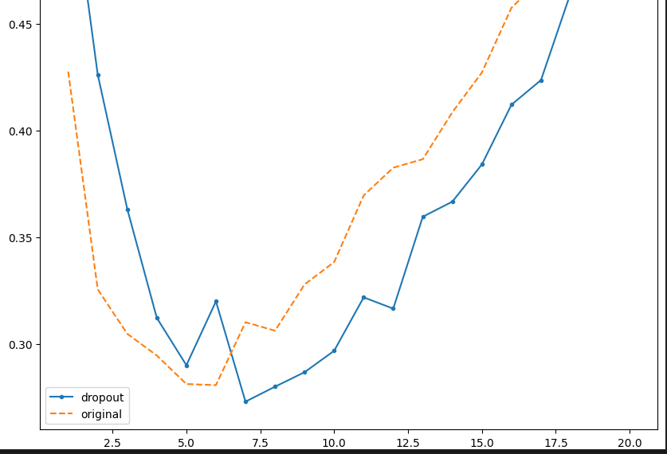
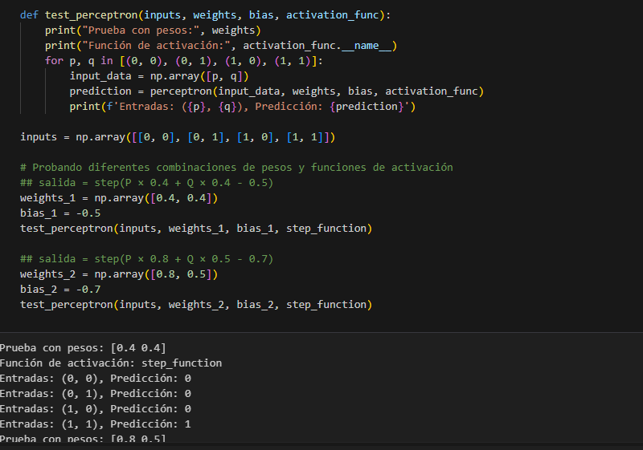

# Redes Neuronales

## Descripción

En este trabajo aprendí sobre diferentes tipos de redes neuronales y cómo pueden utilizarse para clasificar datos. Trabajé con CNN, Keras y perceptrón, observando cómo cada uno funciona de una manera diferente.

## CNN
La CNN es una red neuronal utilizada principalmente para trabajar con imágenes. En este ejercicio se clasificaron imágenes de **vidrio y plástico**
**Clasificación de imágenes**

La imagen muestra un resultado obtenido durante el trabajo con la CNN. La matriz de confusión permite comparar las clases reales con las clases que fueron predichas por el modelo.

Me pareció interesante porque la red puede aprender características de las imágenes y utilizarlas para reconocer a qué categoría pertenece cada una.

## Keras
Keras es una herramienta que permite crear y entrenar redes neuronales de una manera más sencilla. En el ejercicio se utilizaron reseñas de películas del conjunto IMDB para clasificarlas como positivas o negativas.
**Clasificación de reseñas**

La imagen muestra parte del código utilizado para construir el modelo con Keras.

Esta parte me ayudó a entender cómo una red puede aprender a partir de datos y luego realizar una clasificación.

## Perceptrón
El perceptrón es un modelo  que utiliza **entradas, pesos y un sesgo** para obtener una respuesta.
**Ejemplo de decisión**

La imagen muestra el código utilizado para definir y hacer funcionar el perceptrón.

En el ejercicio se utilizaron valores de temperatura y vibración para generar una alerta. También se probaron ejemplos con AND, OR y XOR.

Me pareció interesante porque permite entender de forma sencilla cómo una neurona artificial puede tomar una decisión.

## Lo que aprendí

Durante esta sesión aprendí que las redes neuronales pueden utilizarse para diferentes tipos de problemas.

Lo que más me llamó la atención fue entender que una CNN puede analizar imágenes buscando patrones, mientras que un perceptrón trabaja con entradas, pesos y una función de activación.

También me pareció interesante Keras porque facilita la creación de modelos de redes neuronales y permite trabajar con diferentes capas sin tener que programar todo desde cero.

Otra cosa que aprendí fue que las gráficas y matrices de resultados ayudan a entender mejor cómo está funcionando un modelo y permiten identificar sus aciertos y errores.

