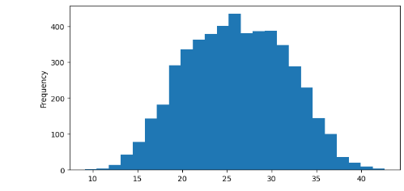
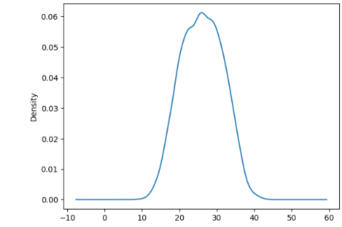
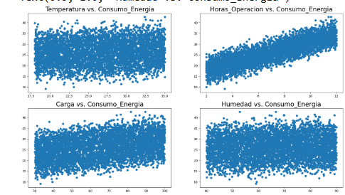
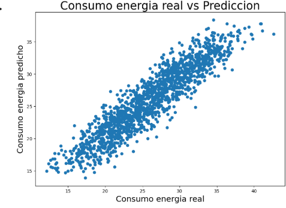
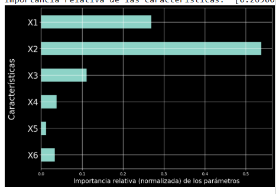

# Regresión Lineal y Árbol de Decisión

## Descripción

En este trabajo se realizó un análisis de datos relacionados con el consumo de energía. Se utilizó un conjunto de 5000 registros con las variables Temperatura, Horas de Operación, Carga, Humedad y Consumo de Energía.

El objetivo fue analizar los datos y aplicar modelos de aprendizaje automático para observar la relación entre las variables y el consumo de energía.

## Temas trabajados

### Regresión lineal

Se utilizó la regresión lineal para analizar la relación entre las variables de entrada y el Consumo_Energia.

Se realizaron gráficos para comparar las variables con el consumo de energía y también se compararon los valores reales con los valores predichos por el modelo.

### Árbol de decisión

También se trabajó con un modelo de árbol de decisión para realizar predicciones sobre el consumo de energía.

Además, se analizó la importancia de las características utilizadas por el modelo.

## Gráficas del trabajo

### 1. Histograma del consumo de energía

Este gráfico permite observar cómo se distribuyen los valores de Consumo_Energia.

### 2. Densidad del consumo de energía

La gráfica de densidad permite observar la distribución de los valores del consumo de energía de una forma más continua.

### 3. Regresión lineal

Se realizaron gráficos para observar la relación entre las variables del conjunto de datos y el Consumo_Energia.

### 4. Consumo real vs. predicción

Se compararon los valores reales del consumo de energía con los valores obtenidos mediante la predicción del modelo.

### 5. Importancia de las características

En el modelo de árbol de decisión se analizó la importancia de las variables utilizadas para realizar las predicciones.

## Datos utilizados

Las variables utilizadas en el análisis fueron:

* **Temperatura**
* **Horas de Operación**
* **Carga**
* **Humedad**
* **Consumo de Energía**

El conjunto de datos contiene 5000 registros y las cinco variables son numéricas.

## Lo que aprendí

En esta sesión aprendí a trabajar con datos y a utilizar modelos de aprendizaje automático para analizar el consumo de energía.

También aprendí que las gráficas ayudan a entender mejor los datos y a observar las relaciones entre las variables. La comparación entre los valores reales y las predicciones permite revisar cómo está funcionando el modelo.

Además, pude conocer el uso de los árboles de decisión y la importancia de las características dentro del modelo.

## Herramientas utilizadas

* Google Colab

## Archivo principal

El archivo utilizado para desarrollar el trabajo es:

`Untitled5.ipynb`

