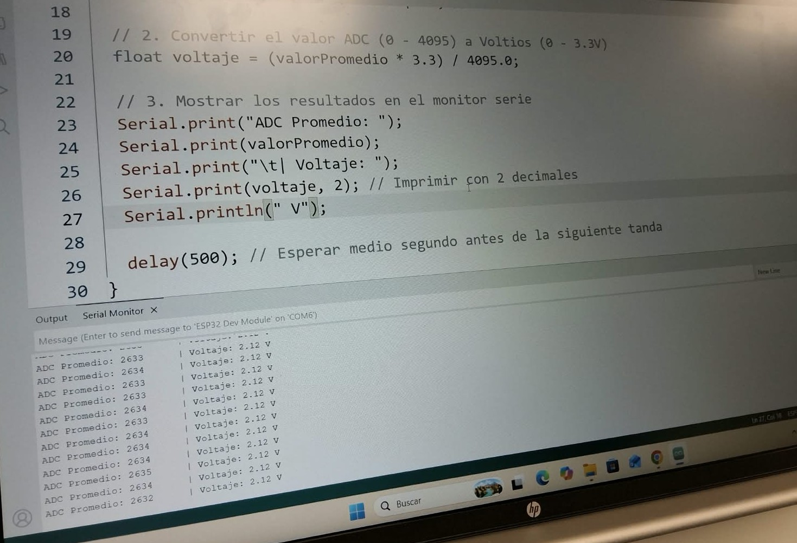
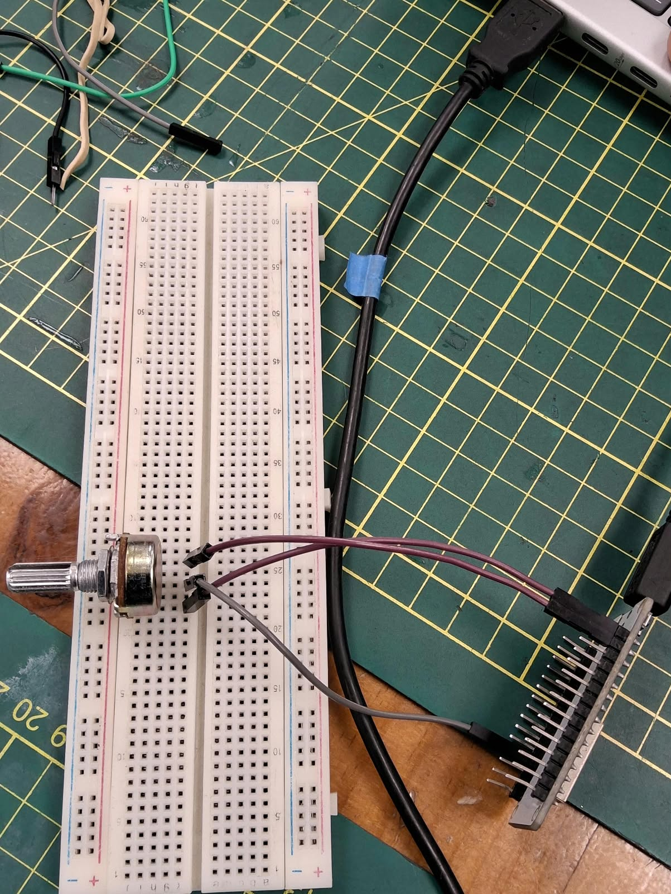
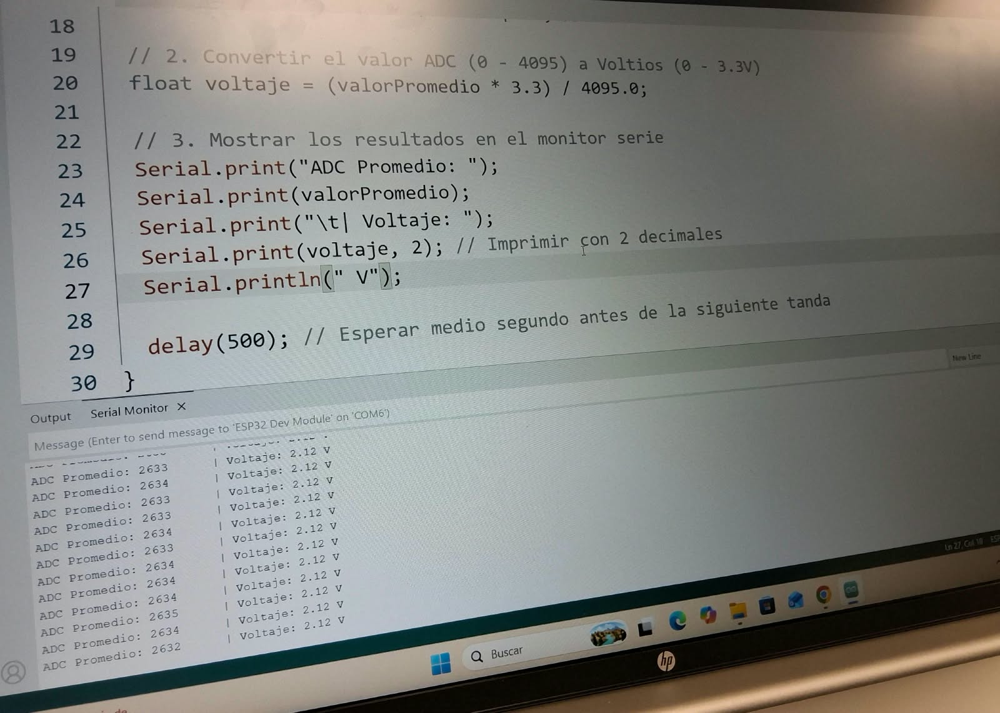
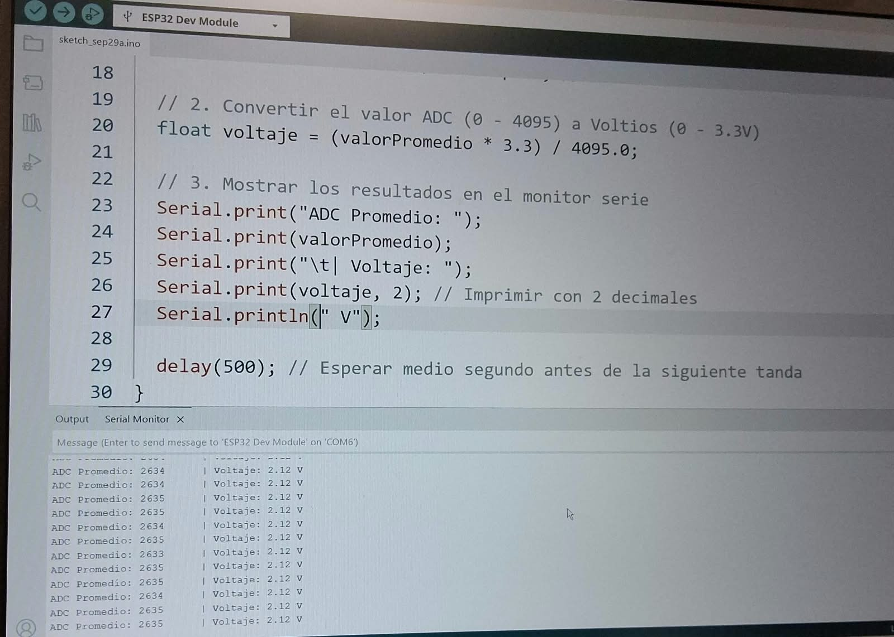
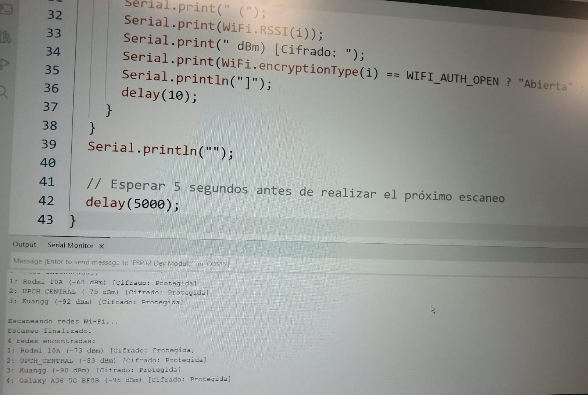
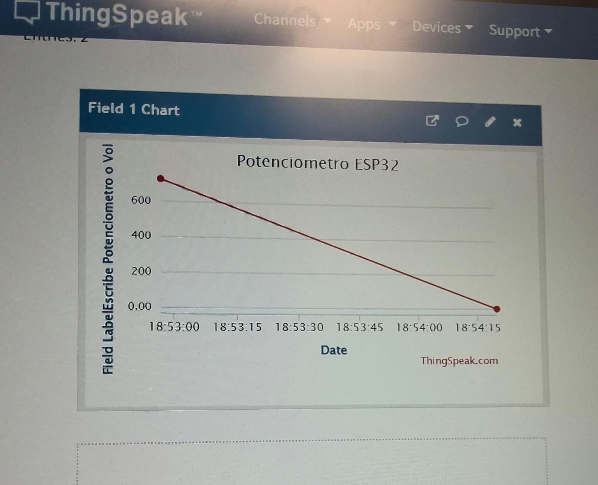
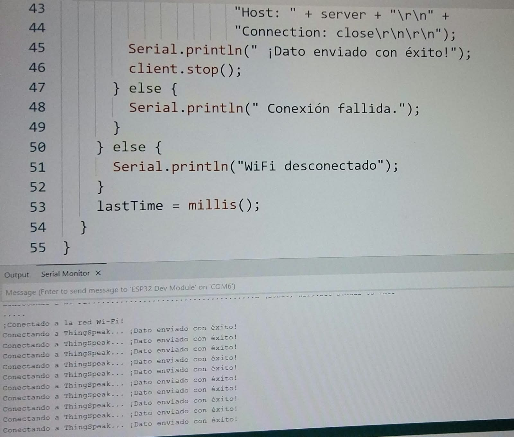
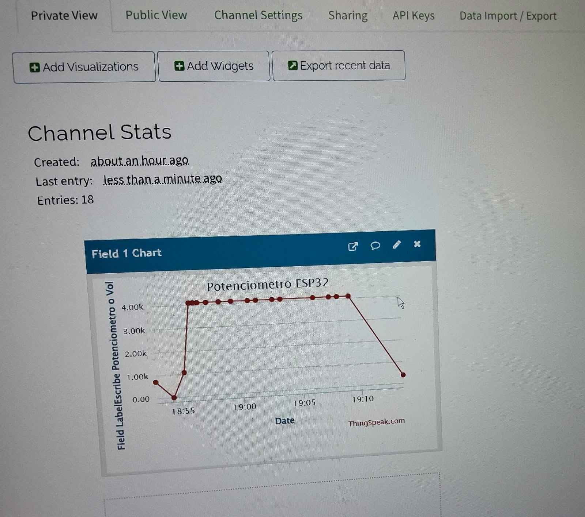
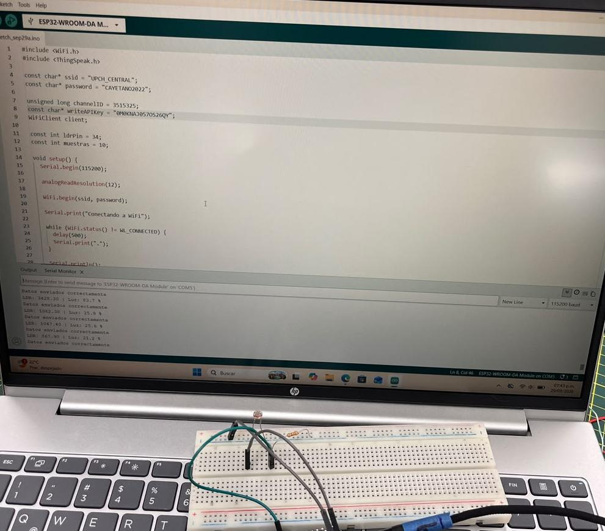
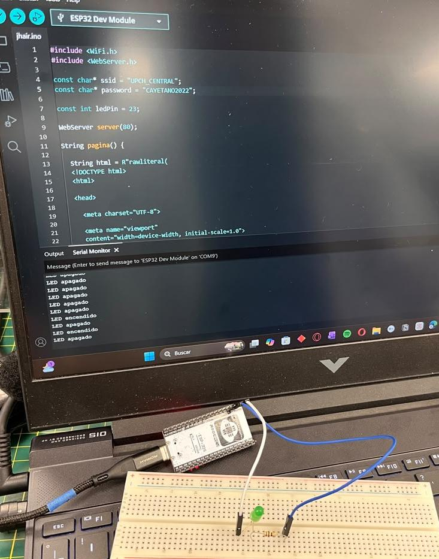

# Taller de Internet con ESP32

## Descripción

En este taller trabajé con el **ESP32** para realizar diferentes actividades relacionadas con Internet  (IoT). Aprendí a leer datos de sensores, conectarme a WiFi, enviar información a la nube y controlar un LED desde una página web.

## Actividad 01 – Lectura del potenciómetro

**Lectura, promedio y voltaje**

### Código

!

### Resultado

En esta actividad trabajé con un potenciómetro conectado al ESP32. Aprendí a leer su valor mediante el monitor serial y a calcular un promedio y el voltaje.

Me pareció interesante observar cómo al mover el potenciómetro cambia el valor que recibe el ESP32.

## Actividad 02 – Conexión WiFi

**Exploración de redes y conexión**

### Código

### Resultado

En esta actividad aprendí a utilizar el ESP32 para buscar redes WiFi disponibles y observar la intensidad de su señal.

Me pareció importante porque la conexión WiFi permite que el ESP32 pueda comunicarse con otros dispositivos y plataformas de Internet.

## Actividad 03 – Enviando datos a la nube

**Potenciómetro y ThingSpeak**

### Código

### Resultado

En esta actividad envié los datos del potenciómetro a **ThingSpeak**. El ESP32 toma varias lecturas, calcula un promedio y obtiene un valor de voltaje.

Lo que más me llamó la atención fue poder enviar los datos del ESP32 a una plataforma en Internet y observarlos desde allí.

## Actividad 04 – Enviando datos a la nube

**Sensor de luz LDR**

### Código

### Resultado

En esta actividad utilicé un **sensor LDR** para medir cambios en la iluminación. El ESP32 toma las lecturas y las envía a ThingSpeak.

Me pareció interesante porque pude comprobar cómo un cambio en la luz se puede convertir en datos y enviarse a la nube.

## Actividad 05 – Controlando desde la nube

**Control de un LED desde la web**

### Código

### Resultado

En esta actividad conecté un LED externo al **GPIO 23 del ESP32** y lo controlé desde una página web.

La página tiene botones para **encender y apagar el LED**. Me pareció una de las actividades más interesantes porque pude controlar un componente físico utilizando una conexión web.

## Lo que aprendí

Este taller me ayudó a comprender mejor cómo funciona el **Internet de las Cosas**. Aprendí que el ESP32 puede recibir información de sensores, conectarse a WiFi, enviar datos a la nube y también recibir órdenes desde una página web.

Lo que más me interesó fue ver cómo una acción física, como mover un potenciómetro o cambiar la iluminación, puede convertirse en datos y ser enviada por Internet. También me pareció interesante poder controlar un LED desde una página web.

## Herramientas utilizadas

* ESP32
* Arduino IDE
* Potenciómetro
* Sensor LDR
* LED
* WiFi
* ThingSpeak

