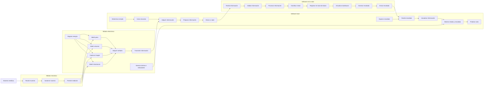
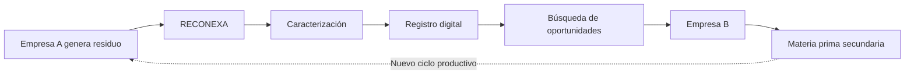

<p align="center">
  
  
  
  
  
</p>

<h1 align="center">♻️ RECONEXA</h1>

<h3 align="center">
Sistema inteligente de caracterización y redistribución de residuos metálicos industriales
</h3>

<p align="center">
  <strong>Equipo 08 | Proyecto Integrador 2026-II</strong>
  <br>
  Universidad Peruana Cayetano Heredia
</p>

<p align="center">
  <em>Caracterización de residuos · Economía circular · IoT · Simbiosis industrial</em>
</p>

<p align="center">
  <strong>Metales con un nuevo propósito.</strong>
</p>

---

# 🌱 Sobre el proyecto

**RECONEXA** es una propuesta tecnológica orientada a la **caracterización preliminar y redistribución de residuos metálicos industriales potencialmente aprovechables**.

El proyecto integra una **estación física de caracterización** con una **plataforma digital conectada a la nube**. La estación recopila información de una muestra mediante sensores y una cámara. Posteriormente, los datos son adquiridos por el sistema electrónico, enviados al software y procesados para generar una clasificación preliminar del material.

Los resultados se almacenan digitalmente y pueden utilizarse para facilitar la identificación de empresas que podrían aprovechar el residuo como **materia prima secundaria**.

RECONEXA busca registrar características como:

- Peso.
- Volumen estimado.
- Imagen de la muestra.
- Respuesta inductiva.
- Tipo probable de material.
- Información del generador.
- Fecha y registro de la caracterización.

> [!IMPORTANT]
> La caracterización realizada por RECONEXA es **preliminar**. El sistema no reemplaza un análisis químico de laboratorio cuando sea necesario conocer la composición exacta, pureza o peligrosidad de un residuo.

---

# 🚨 Problemática

En diferentes actividades industriales se generan residuos metálicos que todavía podrían ser utilizados como insumos para otros procesos productivos. Sin embargo, una parte de estos materiales puede terminar almacenada durante largos periodos, vendida sin suficiente información técnica, gestionada como residuo sin evaluar otras posibilidades de aprovechamiento o enviada a disposición final pese a conservar valor material.

Uno de los principales problemas es la **falta de información disponible sobre los residuos generados**.

Las empresas generadoras no siempre cuentan con herramientas accesibles para registrar características como:

- Qué material poseen.
- Cuánto material tienen disponible.
- Cuáles son sus características físicas.
- Dónde se genera.
- Con qué frecuencia se encuentra disponible.
- Qué empresas podrían aprovecharlo.

Al mismo tiempo, otras empresas que podrían utilizar materias primas secundarias no siempre conocen la existencia de estos materiales.

Esta **brecha de información entre empresas generadoras y posibles receptoras** dificulta el intercambio de materiales y limita el desarrollo de iniciativas de economía circular y simbiosis industrial (Chertow, 2000; Neves et al., 2020).

En el contexto peruano, el Decreto Legislativo N.° 1278 establece como parte de la gestión integral de residuos la eficiencia en el uso de materiales, la minimización de residuos y el aprovechamiento de materiales de descarte que puedan ser utilizados por otras actividades económicas (Congreso de la República del Perú, 2016).

---

# 💡 Propuesta de solución

RECONEXA propone conectar el **mundo físico del residuo** con una **plataforma digital de información**.

El sistema está compuesto principalmente por dos elementos.

## 🔩 1. Estación de caracterización

La estación recibe una muestra metálica y obtiene información utilizando diferentes sistemas de medición.

| Elemento | Función |
|---|---|
| ⚖️ Celda de carga | Medir el peso de la muestra. |
| 📏 Sensor de distancia | Obtener dimensiones para estimar el volumen. |
| 📷 Cámara | Registrar las características visuales de la muestra. |
| 🧲 Sistema de medición inductiva | Obtener una respuesta adicional relacionada con las propiedades del material. |
| 🧠 ESP32 / sistema electrónico | Adquirir, organizar y transmitir los datos. |
| 🖥️ Pantalla LCD | Mostrar el estado y resultado del proceso. |
| 🔊 Indicadores | Comunicar alertas o estados mediante señales visuales o auditivas. |

## ☁️ 2. Plataforma digital

La plataforma recibe la información generada por la estación y permite:

- Registrar residuos caracterizados.
- Validar los datos recibidos.
- Procesar información.
- Generar una clasificación preliminar.
- Almacenar los registros.
- Visualizar información mediante un dashboard.
- Consultar materiales disponibles.
- Relacionar residuos con posibles empresas receptoras.
- Generar oportunidades de aprovechamiento.

De esta manera, RECONEXA busca transformar:

> **Residuo con poca información → Recurso caracterizado y digitalmente registrado**

---

# 🎯 Objetivo general

Desarrollar un prototipo para la **caracterización preliminar de residuos metálicos industriales**, integrando medición física, adquisición electrónica y una plataforma digital, con la finalidad de registrar sus características y facilitar oportunidades para su aprovechamiento como materias primas secundarias entre empresas.

---

# ✅ Objetivos específicos

1. Diseñar una estación capaz de recibir y posicionar muestras metálicas.
2. Integrar sensores para obtener características físicas relevantes de la muestra.
3. Incorporar una cámara para registrar sus características visuales.
4. Adquirir y transmitir las señales mediante un sistema electrónico basado en ESP32.
5. Implementar un sistema local para gestionar el proceso de caracterización.
6. Enviar la información obtenida hacia una plataforma en la nube.
7. Desarrollar un procedimiento de clasificación preliminar basado en las características registradas.
8. Almacenar digitalmente la información de cada muestra.
9. Mostrar los resultados mediante una interfaz local y un dashboard.
10. Proponer un mecanismo digital para relacionar residuos disponibles con posibles empresas interesadas en su aprovechamiento.

---

# ⚙️ Funcionamiento general

El funcionamiento conceptual de RECONEXA comprende las siguientes etapas:

1. **Registro e ingreso:** el usuario registra e introduce una muestra metálica en la estación.
2. **Posicionamiento:** el módulo mecánico recibe y sostiene la muestra en una posición adecuada.
3. **Caracterización:** los sensores miden el peso, estiman el volumen, registran la respuesta inductiva y la cámara captura una imagen.
4. **Adquisición:** el sistema electrónico recopila las señales provenientes de los sensores.
5. **Procesamiento local:** el ESP32 y el software local organizan la información obtenida.
6. **Comunicación:** los datos son enviados hacia la infraestructura en la nube mediante conectividad de red.
7. **Procesamiento en la nube:** la plataforma recibe, valida y procesa la información.
8. **Clasificación preliminar:** se combinan las características de la muestra para determinar un tipo probable de material.
9. **Registro:** las mediciones y el resultado son almacenados en una base de datos.
10. **Retorno:** la nube envía el resultado nuevamente al sistema local.
11. **Visualización:** el resultado se muestra en la pantalla local y puede consultarse mediante un dashboard.
12. **Redistribución:** la plataforma puede utilizar la información registrada para identificar posibles empresas interesadas en aprovechar el material.

---

# 🔄 Simulación conceptual del prototipo

La siguiente animación representa de manera simplificada el flujo previsto para el prototipo.

<p align="center">
  
</p>

<p align="center">
  <em>
    La muestra ingresa a la estación, es caracterizada mediante sensores,
    los datos son enviados para procesamiento y finalmente se muestra
    el resultado de clasificación.
  </em>
</p>

> [!NOTE]
> Para que la animación se muestre correctamente en GitHub, guardar el archivo como:
> `assets/reconexa_simulacion_conceptual.gif`

---

# 🧩 Arquitectura del sistema

RECONEXA se divide conceptualmente en tres módulos principales: **mecánico, electrónico y software**. El software, a su vez, se divide entre procesamiento local y servicios en la nube.



---

# 🔩 Módulo mecánico

El módulo mecánico permite que la muestra sea colocada correctamente para realizar la caracterización.

Sus funciones principales son:

```text
Recibir muestra
       ↓
Sostener muestra
       ↓
Permitir medición de la muestra
```

Este módulo constituye la interacción física inicial entre el residuo y la estación.

---

# ⚡ Módulo electrónico

El módulo electrónico se encarga de la alimentación, adquisición y transmisión de información.

Su flujo general es:

```text
Regular energía eléctrica
          ↓
     Detectar y medir
          ↓
 ┌────────┼──────────┬────────────┐
 ↓        ↓          ↓            ↓
Peso    Volumen    Imagen    Inductancia
 └────────┴──────────┴────────────┘
                 ↓
        Adquirir señales
                 ↓
     Transmitir información
```

Además, este módulo puede generar indicaciones relacionadas con:

- Estado del sistema.
- Alertas.
- Inicio o finalización del ciclo.
- Condiciones de emergencia.

El **ESP32** cumple una función central dentro del sistema electrónico al permitir la adquisición de información y la comunicación con servicios externos. La familia ESP32 integra conectividad Wi-Fi, característica que permite su utilización en aplicaciones de Internet de las Cosas (Espressif Systems, s. f.).

---

# 💻 Software local

El software local funciona como intermediario entre el sistema electrónico y los servicios disponibles en la nube.

Sus funciones comprenden:

```text
Determinar estado del sistema
            ↓
      Iniciar escaneo
            ↓
Adquirir información electrónica
            ↓
Preparar información para envío
            ↓
     Enviar a la nube
            ↓
Esperar resultado de clasificación
            ↓
   Recibir resultado
            ↓
Actualizar información del sistema
            ↓
   Mostrar estado y resultado
            ↓
       Finalizar ciclo
```

La información que aparece en la pantalla es generada a partir del resultado procesado por el software; sin embargo, la **pantalla LCD constituye el medio electrónico físico utilizado para visualizarla**.

---

# ☁️ Software en la nube

El componente en la nube concentra el procesamiento, almacenamiento y gestión de la información.

El flujo conceptual es:

```text
Recibir información
        ↓
Validar información
        ↓
Procesar información
        ↓
Clasificar material
        ↓
Registrar en base de datos
        ↓
Actualizar dashboard
        ↓
Generar resultado
        ↓
Enviar al sistema local
```

La clasificación propuesta es preliminar y se basa en la combinación de las variables disponibles. No debe interpretarse como un análisis de composición química.

---

# 📊 Visualización

RECONEXA contempla tres mecanismos principales para comunicar información.

## 🖥️ Pantalla local

Puede mostrar:

- Estado del equipo.
- Progreso del proceso.
- Resultado de clasificación.
- Datos relevantes de la muestra.

## 🔔 Indicadores visuales y auditivos

Permiten comunicar:

- Sistema preparado.
- Medición en proceso.
- Error.
- Alerta.
- Fin del ciclo.

## 📈 Dashboard

La plataforma en la nube permitirá consultar:

- Muestras registradas.
- Clasificación obtenida.
- Peso.
- Volumen.
- Fecha.
- Empresa generadora.
- Historial de registros.
- Posibles oportunidades de aprovechamiento.

---

# 🧪 Alcance inicial

El prototipo se orienta inicialmente a la caracterización de muestras metálicas como:

- **Cobre.**
- **Aluminio.**
- **Latón.**

El latón es una aleación formada principalmente por cobre y zinc. Por esta razón, resulta más preciso definir RECONEXA como un sistema para la caracterización de **residuos o muestras metálicas** y no como un detector de metales pesados.

La clasificación combinará diferentes características. La imagen **no será utilizada como único criterio**, debido a que materiales diferentes pueden presentar:

- Colores similares.
- Oxidación.
- Suciedad.
- Recubrimientos.
- Cambios superficiales.

---

# 🔄 Economía circular y simbiosis industrial

La economía circular plantea alternativas al modelo lineal de extracción, producción, consumo y descarte, buscando mantener materiales y recursos dentro de ciclos productivos durante más tiempo (Geissdoerfer et al., 2017).

La **simbiosis industrial** se refiere a la cooperación entre organizaciones para intercambiar materiales, energía, agua o subproductos que puedan ser aprovechados por otras actividades (Chertow, 2000). RECONEXA se inspira en este principio al buscar generar información que facilite la conexión entre empresas generadoras de residuos y posibles empresas receptoras.

El principio conceptual puede resumirse mediante el siguiente flujo:



RECONEXA busca, por tanto:

> **Caracterizar → Registrar → Conectar → Aprovechar**

---

# 🌎 Objetivos de Desarrollo Sostenible

RECONEXA se relaciona principalmente con el **ODS 12: Producción y consumo responsables**, y de manera complementaria con el **ODS 9: Industria, innovación e infraestructura**.

## 🥇 ODS principal: ODS 12 — Meta 12.5

La **Meta 12.5** establece que, para 2030, se debe reducir sustancialmente la generación de residuos mediante prevención, reducción, reciclaje y reutilización (United Nations, s. f.-a).

Esta es la meta con mayor relación directa con RECONEXA.

El proyecto busca contribuir mediante el siguiente proceso:

```text
Residuo industrial
        ↓
Caracterización
        ↓
Registro digital
        ↓
Clasificación preliminar
        ↓
Identificación de oportunidades
        ↓
Posible reutilización / reciclaje
        ↓
Menor cantidad de material desaprovechado
```

RECONEXA **no realiza directamente el reciclaje del material**. Su contribución consiste en generar información que facilite que un residuo potencialmente aprovechable pueda ser identificado, registrado y conectado con una alternativa de valorización.

## ♻️ Meta complementaria: ODS 12 — Meta 12.2

La **Meta 12.2** busca alcanzar la gestión sostenible y el uso eficiente de los recursos naturales (United Nations, s. f.-a).

RECONEXA puede contribuir indirectamente a esta meta al facilitar que materiales previamente utilizados puedan volver a incorporarse a procesos productivos como **materias primas secundarias**.

## 🏭 Meta complementaria: ODS 9 — Meta 9.4

La **Meta 9.4** plantea modernizar infraestructuras e industrias para hacerlas más sostenibles, incrementando la eficiencia en el uso de los recursos e incorporando tecnologías y procesos industriales ambientalmente adecuados (United Nations, s. f.-b).

RECONEXA se relaciona con esta meta mediante la integración de:

- Sensores.
- Electrónica.
- IoT.
- Procesamiento de datos.
- Plataforma digital.
- Registro de materiales.
- Simbiosis industrial.

## 📋 Relación resumida con los ODS

| Prioridad | ODS / Meta | Relación con RECONEXA |
| :---: | :--- | :--- |
| 🥇 **Principal** | **ODS 12 – Meta 12.5** | Facilita la identificación y potencial valorización de residuos mediante reutilización o reciclaje. |
| 🥈 Complementaria | **ODS 12 – Meta 12.2** | Favorece el uso eficiente de recursos y el aprovechamiento de materias primas secundarias. |
| 🥉 Complementaria | **ODS 9 – Meta 9.4** | Aplica tecnologías digitales y electrónicas para favorecer procesos industriales más eficientes y sostenibles. |

---

# 📏 Indicadores propuestos

Para evaluar el desempeño del prototipo y su posible contribución se podrán registrar indicadores como:

| Indicador | Unidad |
|---|---:|
| Masa total de residuos caracterizados | kg |
| Número de muestras registradas | unidades |
| Muestras clasificadas preliminarmente | % |
| Registros con oportunidad potencial de aprovechamiento | % |
| Posibles empresas receptoras identificadas | unidades |
| Coincidencias entre generador y receptor | unidades |

Un indicador principal propuesto para RECONEXA es:

> **Porcentaje de residuos metálicos caracterizados para los cuales el sistema identifica al menos una alternativa potencial de aprovechamiento.**

---

# 🇵🇪 Relación con el marco normativo peruano

El **Decreto Legislativo N.° 1278, Ley de Gestión Integral de Residuos Sólidos**, establece lineamientos relacionados con la eficiencia en el uso de materiales, la prevención y minimización de residuos y el aprovechamiento de materiales de descarte.

Su reglamento, aprobado mediante el **Decreto Supremo N.° 014-2017-MINAM**, regula la gestión y manejo de residuos sólidos e incluye la minimización en la fuente y la valorización material y energética de los residuos.

Estos principios guardan relación con la finalidad conceptual de RECONEXA: generar información que permita identificar residuos metálicos con potencial de aprovechamiento.

> [!WARNING]
> RECONEXA no determina por sí solo si un residuo cumple requisitos regulatorios para transporte, comercialización, valorización o manejo especializado. Dichas decisiones deberán ajustarse a la normativa aplicable y, cuando corresponda, a análisis técnicos adicionales.

---

# 👥 Sobre nosotros

Somos el **Equipo 08** del curso **Proyecto Integrador 2026-II** de la Universidad Peruana Cayetano Heredia.

El equipo está conformado por estudiantes de:

- Ingeniería Ambiental.
- Ingeniería Informática.
- Ingeniería Industrial.

Esta formación multidisciplinaria permite abordar el proyecto desde tres perspectivas:

- **Ambiental:** gestión de residuos, economía circular, valorización e impacto ambiental.
- **Tecnológica:** sensores, procesamiento de datos, software y conectividad.
- **Industrial:** diseño del sistema, operación, viabilidad y relación entre empresas.

---

# 📸 Nuestro equipo

<p align="center">
  
  <br>
  <em>Figura 1. Equipo 08 en el campus de la Universidad Peruana Cayetano Heredia.</em>
</p>

---

# 👨‍💻 Integrantes

| Integrante | Rol | Responsabilidad principal |
| :--- | :--- | :--- |
| <br>**Jhosselyn Dayanna Enriquez Aliaga** | **Líder del equipo** | Coordinación, planificación y seguimiento del proyecto. |
| <br>**Alessandra Ugarte Cruz** | **Responsable de investigación** | Investigación del problema, antecedentes y contexto ambiental. |
| <br>**Pedro Jhair Cueva Tantalean** | **Diseñador** | Diseño del prototipo y experiencia de usuario. |
| <br>**Jhonatan Juan Suasnabar Panez** | **Responsable de documentación** | Organización y redacción de la documentación técnica. |
| <br>**Antony Geampier Zuñiga Vasquez** | **Programador y modelador** | Desarrollo de software, procesamiento de datos y modelado. |

---

# 🚧 Estado del proyecto

| Aspecto | Estado |
|---|---|
| Definición de problemática | ✅ |
| Caja negra | ✅ |
| Esquema de funciones | ✅ |
| Matriz morfológica | ✅ |
| Diseño conceptual | ✅ |
| Diseño electrónico preliminar | 🟡 En desarrollo |
| Selección y calibración de sensores | 🟡 En desarrollo |
| Integración del prototipo | ⏳ Pendiente |
| Desarrollo de plataforma | ⏳ Pendiente |
| Clasificación experimental | ⏳ Pendiente |
| Validación del prototipo | ⏳ Pendiente |

### Fase actual

**Diseño conceptual y selección de alternativas.**

### Próxima etapa

Integración progresiva del prototipo y validación experimental de los sensores.

---

# 📈 Resultados esperados

Se espera que el prototipo permita:

- Obtener mediciones básicas de las muestras.
- Registrar digitalmente cada muestra caracterizada.
- Capturar información visual.
- Generar una clasificación preliminar.
- Visualizar el resultado localmente.
- Almacenar información en una plataforma.
- Consultar los registros mediante un dashboard.
- Facilitar la búsqueda de potenciales empresas interesadas.
- Evaluar la repetibilidad de las mediciones.
- Evaluar el desempeño del sistema de clasificación.

---

# ⚠️ Limitaciones iniciales

RECONEXA se encuentra en etapa de desarrollo y presenta las siguientes limitaciones iniciales:

- El prototipo no determina composición química exacta.
- No reemplaza análisis de laboratorio.
- La clasificación dependerá de la calibración de los sensores.
- Los resultados dependerán de las muestras utilizadas durante las pruebas.
- La suciedad puede modificar las mediciones.
- La oxidación puede alterar la apariencia del material.
- Los recubrimientos superficiales pueden dificultar la clasificación.
- Una muestra compuesta por diferentes materiales puede generar resultados ambiguos.
- El mecanismo de conexión entre empresas deberá validarse con usuarios reales.
- La peligrosidad de un residuo no deberá inferirse únicamente mediante el prototipo.

---

# 🔮 Desarrollo futuro

En etapas posteriores podrían incorporarse funciones como:

- Mayor cantidad de materiales reconocibles.
- Mejoras en los algoritmos de clasificación.
- Historial avanzado de caracterizaciones.
- Geolocalización aproximada de residuos disponibles.
- Sistemas de recomendación entre empresas.
- Notificaciones automáticas.
- Estadísticas de aprovechamiento.
- Indicadores de economía circular.
- Seguimiento de materiales redistribuidos.
- Integración con otras tecnologías de identificación.

---

# 📚 Referencias bibliográficas

Las referencias se presentan en formato APA 7.

1. Chertow, M. R. (2000). Industrial symbiosis: Literature and taxonomy. *Annual Review of Energy and the Environment, 25*, 313–337. https://doi.org/10.1146/annurev.energy.25.1.313

2. Congreso de la República del Perú. (2016). *Decreto Legislativo N.° 1278: Decreto Legislativo que aprueba la Ley de Gestión Integral de Residuos Sólidos*. Sistema Nacional de Información Ambiental. https://sinia.minam.gob.pe/normas/ley-gestion-integral-residuos-solidos

3. Espressif Systems. (s. f.). *ESP32 Wi-Fi driver: Overview*. ESP-IDF Programming Guide. https://docs.espressif.com/projects/esp-idf/en/latest/esp32/api-guides/wifi-driver/overview.html

4. Geissdoerfer, M., Savaget, P., Bocken, N. M. P., & Hultink, E. J. (2017). The Circular Economy – A new sustainability paradigm? *Journal of Cleaner Production, 143*, 757–768. https://doi.org/10.1016/j.jclepro.2016.12.048

5. Ministerio del Ambiente del Perú. (2017). *Decreto Supremo N.° 014-2017-MINAM: Reglamento del Decreto Legislativo N.° 1278, Ley de Gestión Integral de Residuos Sólidos*. Plataforma Digital Única del Estado Peruano. https://www.gob.pe/institucion/minam/normas-legales/3695-014-2017-minam

6. Neves, A., Godina, R., Azevedo, S. G., & Matias, J. C. O. (2020). A comprehensive review of industrial symbiosis. *Journal of Cleaner Production, 247*, 119113. https://doi.org/10.1016/j.jclepro.2019.119113

7. United Nations, Department of Economic and Social Affairs. (s. f.-a). *Goal 12: Ensure sustainable consumption and production patterns*. Sustainable Development Goals. https://sdgs.un.org/goals/goal12

8. United Nations, Department of Economic and Social Affairs. (s. f.-b). *Goal 9: Build resilient infrastructure, promote inclusive and sustainable industrialization and foster innovation*. Sustainable Development Goals. https://sdgs.un.org/goals/goal9

---

# 🔎 Relación de las referencias con RECONEXA

| Fuente | Aplicación dentro del proyecto |
|---|---|
| United Nations — ODS 12 | Sustenta la relación con las metas **12.5** y **12.2**. |
| United Nations — ODS 9 | Sustenta la relación con la **Meta 9.4**. |
| Chertow (2000) | Fundamenta el concepto de **simbiosis industrial** y el intercambio de recursos entre organizaciones. |
| Geissdoerfer et al. (2017) | Proporciona fundamentos conceptuales sobre **economía circular**. |
| Neves et al. (2020) | Sustenta la cooperación entre organizaciones para el aprovechamiento de recursos mediante simbiosis industrial. |
| Decreto Legislativo N.° 1278 | Proporciona el marco peruano relacionado con gestión integral de residuos y eficiencia de materiales. |
| D.S. N.° 014-2017-MINAM | Complementa el marco normativo sobre minimización, valorización y manejo de residuos. |
| Espressif Systems | Sustenta técnicamente el uso del **ESP32** para conectividad y transmisión de información. |

---

# 💚 Idea central

<p align="center">
  <strong>
    RECONEXA busca convertir información dispersa sobre un residuo
    en una oportunidad potencial de aprovechamiento.
  </strong>
</p>

<p align="center">
  <strong>Caracterizar → Registrar → Conectar → Aprovechar</strong>
</p>

---

<p align="center">
  <strong>RECONEXA</strong>
  <br>
  <em>Metales con un nuevo propósito.</em>
</p>

<p align="center">
  <strong>Equipo 08 · Proyecto Integrador 2026-II</strong>
  <br>
  Universidad Peruana Cayetano Heredia
</p>

<p align="center">
  ♻️ Caracterización · 🔩 Metales · ☁️ IoT · 🔄 Economía circular
</p>
